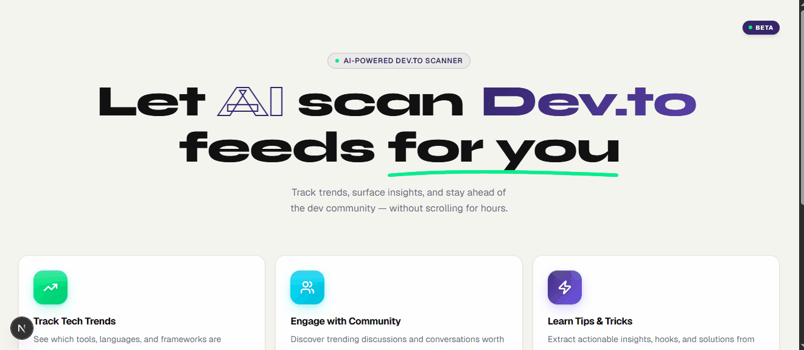

# Dev.to ASSISTANT

Stay updated on what fellow developers are building without drowning in the feed.

Dev.to has a thriving community of 3.9+ million developers sharing open source projects, engineering lessons, tech trends, challenge entries, and more. But manually opening post after post, reading long articles, and hunting for the tech stack or repository link takes hours.

**Dev.to ASSISTANT** is a community intelligence tool powered by **Gemma 4**. Pass any tag (`#notionchallenge`, `#gemmachallenge`, `#githubchallenge`, etc.), and the assistant reads, analyzes, and condenses dozens of posts into an interactive, skim-ready dashboard within seconds.

## Demo



---

## Save Time in 60 Seconds

| Manual Workflow                                | Dev.to ASSISTANT                                           |
| ---------------------------------------------- | ---------------------------------------------------------- |
| Open Dev.to and search a campaign hashtag      | Enter a tag in the dashboard                               |
| Sift through dozens of long posts              | Click **Analyze**                                          |
| Read full articles to find GitHub repositories | Instantly view structured summaries and repo links         |
| Manually compare projects and relevance        | View engagement metrics at a glance                        |
| **Hours of reading and context switching**     | **Faster discovery, inspiration, and analysis in seconds** |

---

## What You Get Per Post

For every analyzed post, the assistant extracts:

- Author
- Original Title
- Problem Statement
- Proposed Solution
- Tech Stack
- GitHub Repository URL (if available)
- Engagement Metrics (reactions and comments)
- Original Dev.to Post URL

---

## Tech Stack

- **LLM:** Gemma 4 via Google GenAI SDK
- **Backend:** FastAPI (modular Python package under `backend/`)
- **Data Processing:** Pandas
- **Frontend:** Next.js (under `frontend/`)
- **Dependency Management:** UV (`pyproject.toml` + `uv.lock`)

---

## Project Structure

```
dev.to-assistant/
├── backend/                  # Python — FastAPI + Gradio + Gemini
│   ├── pyproject.toml
│   ├── uv.lock
│   └── src/
│       ├── main.py           # App entrypoint
│       ├── config.py          # Env vars, constants, Gemini client
│       ├── models/schemas.py  # Pydantic schemas
│       ├── services/
│       │   ├── scanner.py     # DevToScanner agent
│       │   ├── analyzer.py    # PostAnalyzer agent (Gemini)
│       │   └── compiler.py    # ResultCompiler agent
│       ├── api/routes.py      # FastAPI router
│       └── gradio_ui/app.py   # Gradio Blocks UI
├── frontend/                  # Next.js — interactive dashboard
│   ├── app/
│   ├── components/
│   ├── hooks/
│   ├── styles/
│   └── public/
├── media/                     # Demo GIFs and screenshots
├── .gitignore
├── GEMINI.md
├── CONTRIBUTING.md
├── LICENSE
└── README.md
```

---

## Quick Start

### 1. Clone the Repository

```bash
git clone https://github.com/siddqamar/dev.to-assistant.git
cd dev.to-assistant
```

### 2. Install Backend Dependencies

```bash
cd backend
uv sync
```

### 3. Configure Environment Variables

```bash
echo "GOOGLE_API_KEY=your_key_here" > .env
```

### 4. Start the Backend Server

```bash
uv run python -m src.main
```

### 5. Start the Frontend Server

Open a new terminal window, then run:

```bash
cd frontend
npm install
npm run dev
```

The backend and frontend need to run at the same time.

---

## Running Tests

Backend:

```bash
cd backend
uv sync --group dev
uv run pytest
```

Frontend:

```bash
cd frontend
npm install
npm run test
```

GitHub Actions runs these checks automatically on pushes to `main` and on pull requests that target `main`.

---

## Why Developers Use This

- Discover high-signal posts faster
- Spot reusable ideas and micro-SaaS opportunities
- Find repositories worth exploring or contributing to
- Stay active in the developer community without spending hours reading every post
- Track challenge submissions more efficiently

---

## Support the Project

If this project helped you discover useful repositories, save time, or spark a new idea, consider giving it a star on GitHub.

Your support helps the project grow and encourages future improvements.
